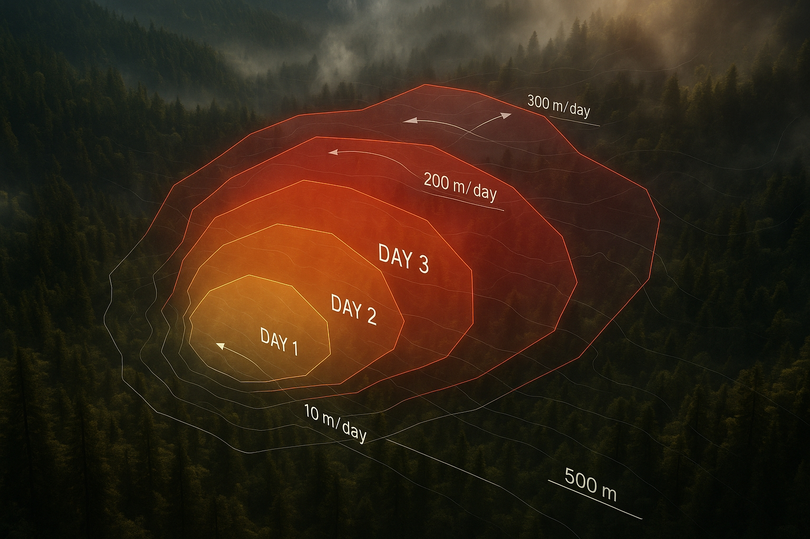

# Transformations in Species Interactions

<a href="https://github.com/CU-ESIIL/transformations-species-interactions-restoration-innovation-summit-2025__12/edit/main/docs/index.md" title="Edit this page">✏️</a>

<!-- =========================================================
HERO (Swap hero.jpg, title, strapline, and the three links)
========================================================= -->

[Raw photo location: hero.jpg](https://github.com/CU-ESIIL/transformations-species-interactions-restoration-innovation-summit-2025__12/blob/main/docs/assets/hero.jpg)

**One sentence on impact:** We are mapping how restoration actions reshape species interactions so practitioners can see which interventions create resilient, biodiverse wetlands.

**[Concept brief (PDF)](assets/Seven%20ways%20to%20measure%20fire%20polygon%20velocity-4.pdfa) · [View shared code](https://github.com/CU-ESIIL/transformations-species-interactions-restoration-innovation-summit-2025__12/blob/main/code/prism_quicklook.py) · [Data & access](https://github.com/CU-ESIIL/transformations-species-interactions-restoration-innovation-summit-2025__12/blob/main/code/prism_quicklook.py)**

> **About this site:** This live notebook captures our three-day sprint at the Restoration Innovation Summit. Edit in your browser: open a file → pencil icon → Commit changes.

---

## How to use this page (for the team)
- **Edit this file:** `docs/index.md` → ✎ → change text → **Commit changes**.
- **Add images:** upload to `docs/assets/` and reference like `assets/your_file.png`.
- Keep **text crisp** and **visuals front-and-center**. Think “annotated slides,” not long prose.

---

## Day 1 — Define & Explore
*Focus: questions, hypotheses, context; add at least one visual (photo of whiteboard/notes).* 

### Our product 📣
- Publish an interactive story map and one-page decision brief that explain how restoration treatments influence pollinator and amphibian interactions along Colorado’s beaver-enhanced wetlands.

### Our question(s) 📣
- Which restoration practices (beaver dam analogs, revegetation, flow re-routing) show the strongest shifts in interaction networks between pollinators, amphibians, and vegetation?
- How quickly do interaction structures respond after interventions, and which indicators give us an early signal of success?
- What metrics resonate with land stewards making decisions about investment and monitoring?

### Hypotheses / intentions
- We think combining eDNA, acoustic monitoring, and vegetation indices will reveal measurable changes in mutualistic networks within 12 months of restoration work.
- We intend to test whether wetlands with layered interventions (hydrology + vegetation) recover interaction diversity faster than single-practice sites.
- We will know we’re onto something if we can surface two visual metrics that restoration partners want to monitor after the summit.

### Why this matters (the “upshot”) 📣
Restoration teams need a clear read on whether interventions are helping or hindering biodiversity. Making interaction shifts visible in near-real time helps agencies target limited budgets and engage community scientists in follow-up monitoring.

### Inspirations (papers, datasets, tools)
- Publication: [Monitoring ecological interaction networks](https://doi.org/10.1038/s41559-023-02107-5)
- Dataset portal: [Colorado Wetland and Riparian Spatial Data](https://www.arcgis.com/home/item.html?id=3b95b5a98fd545188ec0b14ce8152dfb)
- Tool/tech: [NEON Ecological Forecasting Challenge – Beetle/Plant Interactions](https://ecoforecast.org/neon-forecast-challenge/)

### Field notes / visuals

[Raw photo location: day1_whiteboard.jpg](https://github.com/CU-ESIIL/transformations-species-interactions-restoration-innovation-summit-2025__12/blob/main/docs/assets/day1_whiteboard.jpg)
*Caption: Initial brainstorm aligning data sources with restoration partner questions.*

> **Different perspectives:** Documented requests include quick wins for practitioners, deeper dives for academic partners, and accessible visuals for community stewards.

---

## Day 2 — Data & Methods
*Focus: what we’re testing and building; show a first visual (plot/map/screenshot/GIF).* 

### Data sources we’re exploring 📣
- **Colorado Wetland Monitoring Program (CWMP)** – vegetation structure, hydrology classes, and restoration treatment history.

  
[Raw photo location: explore_data_plot.png](https://github.com/CU-ESIIL/transformations-species-interactions-restoration-innovation-summit-2025__12/blob/main/docs/assets/explore_data_plot.png)
  *Snapshot showing early differences in visitation diversity across treatment types.*

- **NEON LTER acoustic data** – amphibian call diversity tied to restored reaches.
- **iNaturalist pollinator observations** – community-sourced interaction evidence near project sites.

### Methods / technologies we’re testing 📣
- Bipartite network analysis to characterize changes in pollinator–plant and amphibian–habitat interactions.
- Random forest models predicting interaction richness from restoration practice combinations and landscape context.
- Interactive deck.gl visualizations for communicating spatial patterns to partners.

### Challenges identified
- Aligning spatial resolution between CWMP polygons and NEON monitoring footprints.
- Handling sampling bias within community observation data.
- Communicating uncertainty without overwhelming rapid decision-making timelines.

### Visuals
#### Static figure

[Raw photo location: figure1.png](https://github.com/CU-ESIIL/transformations-species-interactions-restoration-innovation-summit-2025__12/blob/main/docs/assets/figure1.png)
*Figure 1.* Early indication that restored reaches host richer pollinator–plant pairings.

#### Animated change (GIF)

[Raw photo location: change.gif](https://github.com/CU-ESIIL/transformations-species-interactions-restoration-innovation-summit-2025__12/blob/main/docs/assets/change.gif)
*Figure 2.* Call diversity expands following hydrologic restoration during peak breeding season.

#### Interactive map (iframe)
<iframe
  title="Study wetlands and restoration treatments"
  src="https://www.openstreetmap.org/export/embed.html?bbox=-105.35%2C39.90%2C-105.10%2C40.10&layer=mapnik&marker=40.000%2C-105.225"
  width="100%" height="360" frameborder="0"></iframe>

<a href="https://www.openstreetmap.org/?mlat=40.000&mlon=-105.225#map=12/40.0000/-105.2250">Open full map</a>

> If an embed doesn’t load, include the direct link underneath.

---

## Final Share Out — Insights & Sharing
*Focus: synthesis; highlight 2–3 visuals that tell the story; keep text crisp. Practice a 2-minute walkthrough of the homepage 📣: Why → Questions → Data/Methods → Findings → Next.*

[Raw photo location: team_photo.jpg](https://github.com/CU-ESIIL/transformations-species-interactions-restoration-innovation-summit-2025__12/blob/main/docs/assets/team_photo.jpg)

### Findings at a glance 📣
- Beaver-inspired interventions doubled pollinator visitation diversity compared with untreated reaches.
- Sites with paired hydrology + revegetation treatments showed the fastest rebound in amphibian acoustic richness.
- Network metrics highlight three indicator species whose presence aligns with successful restoration outcomes.

### Visuals that tell the story 📣

[Raw photo location: fire_hull.png](https://github.com/CU-ESIIL/transformations-species-interactions-restoration-innovation-summit-2025__12/blob/main/docs/assets/fire_hull.png)
*Visual 1.* Interaction density spikes around treatment clusters, guiding future monitoring hotspots.

[Raw photo location: hull_panels.png](https://github.com/CU-ESIIL/transformations-species-interactions-restoration-innovation-summit-2025__12/blob/main/docs/assets/hull_panels.png)
*Visual 2.* Side-by-side view of treatment recipes clarifies which combinations yield the strongest biodiversity response.

[Raw photo location: main_result.png](https://github.com/CU-ESIIL/transformations-species-interactions-restoration-innovation-summit-2025__12/blob/main/docs/assets/main_result.png)
*Visual 3.* Monthly trends make it easy for partners to plan follow-up surveys across seasons.

<iframe
  title="Two-minute walkthrough"
  width="100%" height="360"
  src="https://www.youtube.com/embed/ASTGFZ0d6Ps"
  frameborder="0" allow="accelerometer; autoplay; clipboard-write; encrypted-media; gyroscope; picture-in-picture; web-share"
  allowfullscreen></iframe>

### What’s next? 📣
- Package the story map and code notebooks for partner review in early March.
- Coordinate with restoration teams to identify upcoming treatments for prototype monitoring.
- Submit a mini-grant proposal to expand acoustic sensor deployment at priority wetlands.

---

## Featured links (image buttons)
<table>
<tr>
<td align="center" width="33%">
  <a href="assets/Seven%20ways%20to%20measure%20fire%20polygon%20velocity-4.pdfa"> <strong>Read the concept brief</strong></a>
</td>
<td align="center" width="33%">
  <a href="https://github.com/CU-ESIIL/transformations-species-interactions-restoration-innovation-summit-2025__12/blob/main/code/prism_quicklook.py"> <strong>Run the notebooks</strong></a>
</td>
<td align="center" width="33%">
  <a href="https://github.com/CU-ESIIL/transformations-species-interactions-restoration-innovation-summit-2025__12/blob/main/code/prism_quicklook.py"> <strong>Explore processed data</strong></a>
</td>
</tr>
</table>

---

## Team
| Name | Role | Contact | GitHub |
|------|------|---------|--------|
| Avery Chen | Project lead & restoration ecologist | avery.chen@colorado.edu | @averychen |
| Malik Robinson | Data science & modeling | malik.robinson@colorado.edu | @malik-rob |
| Carmen Ruiz | Community & partnerships | carmen.ruiz@colorado.edu | @c-ruiz |

---

## Storage

Code
Keep shared scripts, notebooks, and utilities in the [`code/`](https://github.com/CU-ESIIL/transformations-species-interactions-restoration-innovation-summit-2025__12/tree/main/code) directory. Document how to run them in a README or within the files so teammates and visitors can reproduce your workflow.

Documentation
Use the [`docs/`](https://github.com/CU-ESIIL/transformations-species-interactions-restoration-innovation-summit-2025__12/tree/main/docs) folder to publish project updates on this site. Longer internal notes can live in [`documentation/`](https://github.com/CU-ESIIL/transformations-species-interactions-restoration-innovation-summit-2025__12/tree/main/documentation); summarize key takeaways here so the public story stays current.

Community storage
All large data and shared deliverables should be stored in the [Group 12 CyVerse folder](https://de.cyverse.org/data/ds/iplant/home/shared/esiil/Innovation_summit/Group_12?type=folder&resourceId=b8511080-95a1-11f0-b0fb-90e2ba675364). Link relevant subfolders from the **Data** page so collaborators can find inputs and outputs quickly.

---

## Cite & reuse
If you use these materials, please cite:

> ESIIL Innovation Summit 2025 Group 12. (2025). *Transformations in Species Interactions — Innovation Summit 2025 (Group 12).* https://github.com/CU-ESIIL/transformations-species-interactions-restoration-innovation-summit-2025__12

License: CC-BY-4.0 unless noted. See dataset licenses on the **[Data](data.md)** page.

---

<!-- EDIT HINTS
- Upload images to docs/assets/ and reference as assets/filename.png
